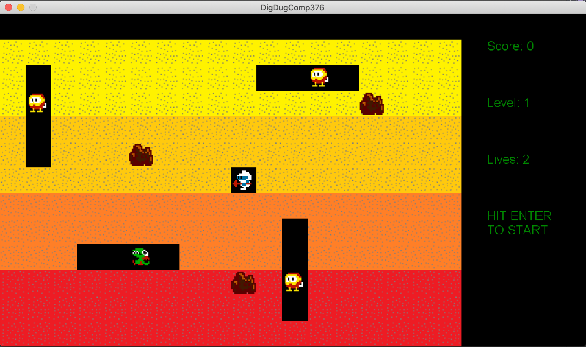

# DigDugComp376

## About

This project is an attempt at recreating Dig Dug's *basic functionality* for educational purposes only and is in no way affiliated with **Namco** or **Atari, Inc.**. Some assets from the original Dig Dug have been borrowed and no copyright infringement is intended.

To run the game, you must have MonoGame installed.

## Features

- Two levels.
- Two lives.
- Dig Dug's hose weapon.
- Fygar and Pooka enemies.
- Ghost mode for enemies. Enemies will move to the player's last position when ghost mode was activated.
- Falling rocks that can kill Dig Dug and solid enemies.

## Controls

<kbd>↑</kbd>: Move Up

<kbd>↓</kbd>: Move Down

<kbd>←</kbd>: Move Left

<kbd>→</kbd>: Move Right

<kbd>space</kbd> (hold): Use Hose

<kbd>enter</kbd>: Start level

<kbd>esc</kbd>: Quit

